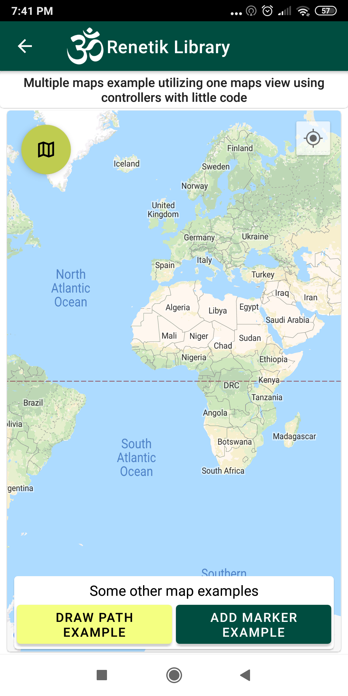
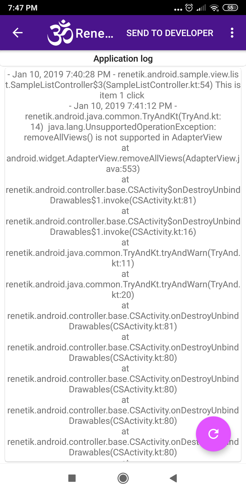
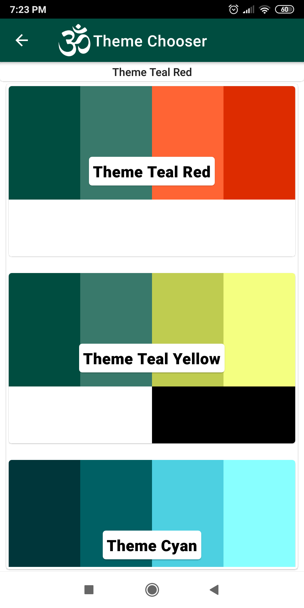
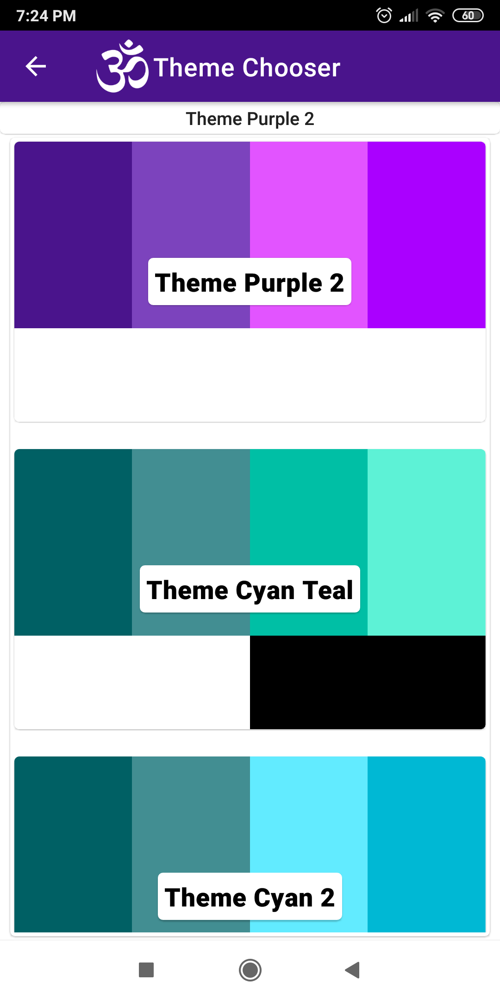

# Renetik Android Library

Framework to enjoy, improve and speed up your application development while writing readable code.

[](https://travis-ci.org/rene-dohan/renetik-android)

# Table of Contents

1. [About](#about)
2. [Getting Started](#getting-started)
3. [Framework](#framework)
4. [Base](#base)
5. [Themes](#themes)
6. [Controller](#controller)
7. [List and Grid Controller](#list)
8. [Request List and Grid Controller](#request-list)
9. [Get Picture Controller](#get-picture)
10. [Maps Controller](#maps)
11. [Dialog](#dialogs)
12. [Json](#json)
13. [Client](#client)
14. [Client OKHTTP3](#client-okhttp3)
15. [Crashlytics](#crashlytics)
16. [Imaging](#imaging)
17. [Material](#material)

# About
I started with this framework few years ago with my first Android application and made similar framework with similar classes for iOS too so I could write more easily two applications from my client fro both platfroms, one for Android and other for iOS while keeping similar structure of code. Then framework mutated as I was easily developing apps further and 3 months ago I rewrote this framework to kotlin and polished while removing large old unused parts with idea to release it for others and showcase how I code for development clients or companies who can hire me for software development.
I didn't try to re-invent the wheel but with background from multiple platfroms and languages I just see how things can be done nicely without some overcomlexities of Android framework like activities lifetime, fragments, java listeners and so on. For example I missed event classes similar to that used in c# and other programming patterns, like Navigation from iOS so I made them.
I am sure there are number of other libraries that alrady has those features, with some pros and cons, but I was able to keep this code functional and usefull for me for quite a few years so I dont need to look for code from others that can be quite dificult to fix if problems happens. I always tried to use good libraries but for example CSEvent classes are quite old maybe 7 years now, and are still quite usefull and well tested by time. So I believe it's good time to share this with some guide how this can be used for rapid and high quality aplication development.

# Getting Started
Good way to start with the framework, is to download checkout or fork it, open in Android Studio and run sample application while look at how code is written. Code is quite readable and self explanatory and in this documentation I will show snippets from sample application and framework to explain how it can be used and how I use it in my own projects.

## Sample Application:
<p align="center">
    
    
    
    
    
    
</p>
Sample application showcase some of the most visible features of framework, some of them are more hidden and I will try to mention most of them. Sample application shows how with few lines of code complex features can be implemented and still keepeng code readable. Basis of application are ViewControllers and NavigationController. Controllers can be pushed to navigation controller stack and in each controller can be used, instead of onCreate,onResume... wery simple methods like onViewShowing with some othe features that makes life easier. But somtimes its even not needed because ListController and simmilar can access them by events delegation. Still underdehood are accessible android methods that are called from Activity if they are needed somehow. But in whole sample application there is no need for them.

I also made sever side project in Spring Boot so Sample application communicate with heroku server by simple rest api. Server sample project is here [Renetik Library Sample Server](https://github.com/rene-dohan/renetik-library-sample-server)

## Framework
[  ](https://bintray.com/rene-dohan/maven/renetik-android:framework/_latestVersion)

The `framework` module contains everything in this library. So it's convenient way to add all to gradle dependencies in one line.

```gradle
dependencies {
  ...
  implementation 'renetik.android:framework:$renetik_version'
}
```
Then you need to create class that extends CSApplication and add it to Manifest.
```kotlin
import renetik.android.sample.BuildConfig.DEBUG

class SampleApplication : CSApplication() {
    override val isDebugBuild = DEBUG
}
```
```xml
<manifest 
    ...
    <application
        android:name=".model.SampleApplication"
        ...
```
Most if not all library classes are prefixed with CS, so they can be easyly recognized and found. 

## Base
[  ](https://bintray.com/rene-dohan/maven/renetik-android:base/_latestVersion)

The `base` module contains various extensions and classes used across the framework. 

```gradle
dependencies {
  ...
  implementation 'renetik.android:base:$renetik_version'
}
```
Most notable class is CSEvent. It's usage can be understood by looking at this test:
```kotlin
    private var eventOneCounter = 0
    private var eventOneValue = ""
    private val eventOne = event<String>()
    @Test
    fun twoListenersCancelBothInSecond() {
        val eventOneRegistration = eventOne.run { _, value ->
            eventOneCounter++
            eventOneValue = value
        }
        eventOne.run { registration, value ->
            eventOneCounter++
            eventOneValue = value
            registration.cancel()
            eventOneRegistration.cancel()
        }
        eventOne.fire("testOne")
        assertEquals(2, eventOneCounter)
        assertEquals("testOne", eventOneValue)

        eventOne.fire("testTwo")
        assertEquals(2, eventOneCounter)
        assertEquals("testOne", eventOneValue)
    }
```
There are also some helper methods that use this class for delegation and decupling, most intresting example of usage is seen in [Maps](#maps) module for automatic cancelation of listeners when view controller is hidden. 


## Controller
[  ](https://bintray.com/rene-dohan/maven/renetik-android:controller/_latestVersion)
```gradle
dependencies {
  ...
  implementation 'renetik.android:controller:$renetik_version'
}
```
The `controller` module contains basic mvc fuctionality fro building nice applicartion without relying on Android concepts
like Activities and Fragments, but still you can use them if needed. Most important class is CSViewController and also CSNavigationController packed with extensionsto do many thing more elegantly then is coomon. Loog at this implementation of Navigation controller from one project.

```kotlin
class DriverNavigationController(activity: NavigationActivity) : CSNavigationController(activity) {

    val mapController = CSMapController(this)

    override fun onViewShowingFirstTime() {
        super.onViewShowingFirstTime()
        requestDriverApplicationPermissions()
    }

    private fun requestDriverApplicationPermissions() {
        requestPermissions(list(READ_EXTERNAL_STORAGE, WRITE_EXTERNAL_STORAGE, ACCESS_FINE_LOCATION,
                CAMERA),
                onGranted = { StoppedRoutesController().push() },
                onNotGranted = {
                    dialog("Application cannot work without this permissions",
                            "You need to allow application to use this permissions to work or it will exit")
                            .show("Allow permissions", { requestDriverApplicationPermissions() },
                                    "Exit", { activity().finish() })
                })
    }

    override val navigationItemTitle = "Reality Driver"
}

```
Yo can see there are used extensions to request permisions with callbacks. And special function onViewShowingFirstTime that is called exactly how it's named. To be continued... 


## Themes
[  ](https://bintray.com/rene-dohan/maven/renetik-android:controller-themes/_latestVersion)

<p align="center">
    
    
    
</p>
<p align="center">
    
    
    
    
    
    
</p>

The `controller-themes` module contains Themes controller and default themes with some code that initialize it. 

```gradle
dependencies {
  ...
  implementation 'renetik.android:controller-themes:$renetik_version'
}
```
You initialized themes before view is created, in example I do it like this:
```kotlin
class SampleNavigationActivity : CSActivity() {
    override fun createController(): CSNavigationController {
        CSThemes.initialize(this)
        return SampleNavigation(this)
    }
}
```
Then you can show build in theme chooser controller or create you own:
```kotlin
CSThemeChooserController(navigation).push()
```
As well as you can create your own themes instead of default ones. Example theme from themes.xml:
```xml
 <style name="CSThemeCyan" parent="Theme.MaterialComponents.DayNight.DarkActionBar">
        <item name="colorPrimary">#00363a</item>
        <item name="colorPrimaryVariant">#006064</item>
        <item name="colorSecondary">#4dd0e1</item>
        <item name="colorSecondaryVariant">#88ffff</item>
        <item name="colorOnPrimary">#ffffff</item>
        <item name="colorOnSecondary">#000000</item>
</style>
```
You can then pass list with themes to `CSThemes.initialize(this)` as second parameter.

## List
[  ](https://bintray.com/rene-dohan/maven/renetik-android:controller-list/_latestVersion)

<p align="center">
    
    
    
    
</p>

The `controller-list` module contains principal list controller andother controllers and for other use cases like list actions, loading of reqeuests, loadnext after scrooll, search, so all this repetuos tasks can be implemented with nice simple code. 

```gradle
dependencies {
  ...
  implementation 'renetik.android:controller-list:$renetik_version'
}
```
Basic list or grid controller can be seen in sample application.
This all code you need to make fully functional list with loaded items from your model list, functional search residing in action bar, and possibility to remove items by long click and selection remove like you see in pictures. Also with list is empty text view displaying.
```kotlin
    private val listController = CSListController<ListItem, ListView>(this, R.id.SampleList_List) {
        CSRowView(this, layout(R.layout.sample_list_item)) { row ->
            textView(R.id.header).title(row.time)
            textView(R.id.title).title(row.title)
            textView(R.id.subtitle).title(row.subtitle)
        }
    }.onItemClick { rowView -> snackBarInfo("SampleListItemView clicked ${rowView.data.title}") }
            .emptyView(R.id.SampleList_ListEmpty)
    private val searchController = CSSearchController(this) { reloadList() }
    
    init {
        menuItem(searchController.view)
        CSRemoveListRowsController(listController, "Remove selected items ?") { toRemove ->
            toRemove.forEach { item -> model.sampleList.remove(item) }
            model.save()
            listController.reload(model.sampleList.list)
        }
        reloadList()
    }
    
    private fun reloadList() {
        listController.reload(
                if (searchController.text.isEmpty()) model.sampleList.list
                else list<ListItem>().apply {
                    for (row in model.sampleList)
                        if (row.searchableText.contains(searchController.text, ignoreCase = true)) add(row)
                })
    }
```
Here is how layout for list is made, there are special styles in framewrok that make xml layout files quite readable too.
```xml
        <com.google.android.material.card.MaterialCardView style="@style/CSContentCardMatchFill">

        <ListView
            android:id="@+id/SampleList_List"
            style="@style/CSListMatch" />

        <TextView
            android:id="@+id/SampleList_ListEmpty"
            style="@style/CSWrap"
            android:text="No items in list"
            android:textAppearance="@style/CSTextHeadline6"
            android:textColor="@color/cs_dark_grey_text" />

    </com.google.android.material.card.MaterialCardView>
```

## Request List

Simillarily there is CSRequestListController in `controller-list` module that supports CSRequest classes from `client` module for loading data from server , loading next functionality swipe to refresh and already mentioned classes can be seen here in action:

<p align="center">
    
    
    
    
</p>

Made by this code:

```kotlin
val listController = CSRequestListController<ServerListItem, ListView>(this, R.id.SamplePageList_List) {
        CSRowView(this, layout(R.layout.sample_page_list_item)) { row -> view.loadPageListItem(row) }
    }.onReload { progress ->
        model.server.loadSampleList(page =  1).send(getString(R.string.SampleDynamicMenu_Text), progress)
    }.onItemClick { view ->
        dialog("List item:").showView(R.layout.sample_page_list_item).loadPageListItem(view.data)
    }.emptyView(R.id.SamplePageList_ListEmpty)

    init {
        CSRequestListLoadNextController(listController, R.layout.cs_list_load_next) {
            model.server.loadSampleList(it.pageNumber).send("Loading list items", progress = false)
        }
        CSRemoveListRowsController(listController, "Remove selected items ?") { toRemove ->
            model.server.deleteSampleListItems(toRemove).sendWithProgress("Deleting list item")
                    .onSuccess { listController.reload(progress = true).forceNetwork() }
        }
        swipeRefresh(R.id.SamplePageList_Pull).listController(listController)
    }

    override fun onViewShowingFirstTime() {
        super.onViewShowingFirstTime()
        listController.reload(progress = true).forceNetwork()
    }

    private fun View.loadPageListItem(row: ServerListItem) = apply {
        imageView(R.id.SamplePageListItem_Image).image(row.image)
        textView(R.id.SamplePageListItem_Title).title(row.name)
        textView(R.id.SamplePageListItem_Subtitle).title(row.description)
    }
```
 
# To be continued.....
